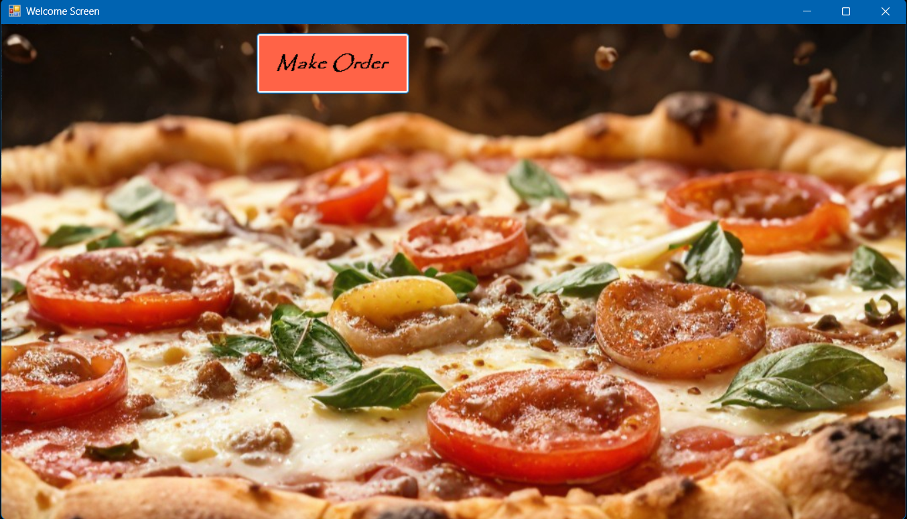
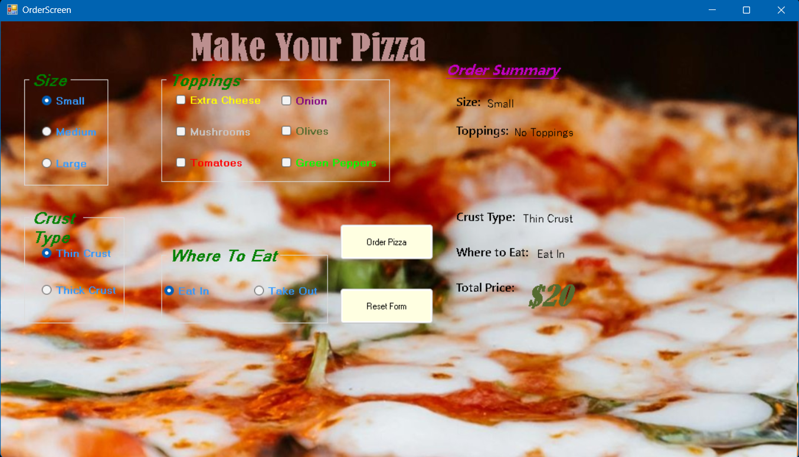
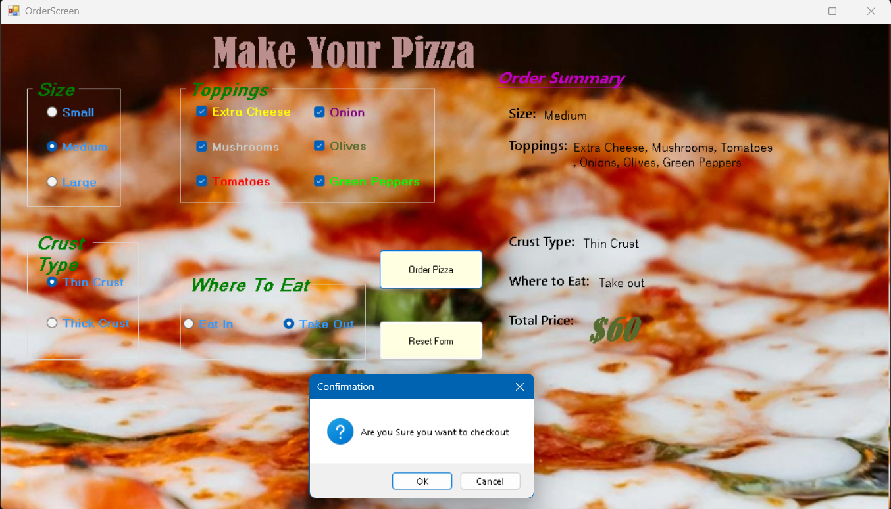

# Pizza-Maker-GUI
### The system provides a user-friendly menu where customers can select pizza types, sizes, toppings, etc.
### It calculates total prices and supports order confirmation and reset form. 

---

##  Demo Video

 [Watch the full video demo on Drive](https://drive.google.com/file/d/1H-xXM9XY8hjSYJE20fTR3xP03DsX8CO8/view?usp=sharing)

---

##  Table of Contents

- [Tools and Framework](#tools-and-framework)
- [Features](#features)
- [Screenshots](#screenshots)

---

## Tools and Framework
- `C#`
- `.NET Framework` (WinForms)

---

## Features

-  Menu interface with pizza types and sizes
-  Optional toppings and extras
-  Automatic total price calculation
-  Button-based user interaction with real-time updates

---

## Screenshots

- **Welcome Screen**
  
  

- **Default Order Screen**
  
  

- **Choices 1**
  
  

- **Choices 2**
  
  

- **Confirmation Message**
  
  

